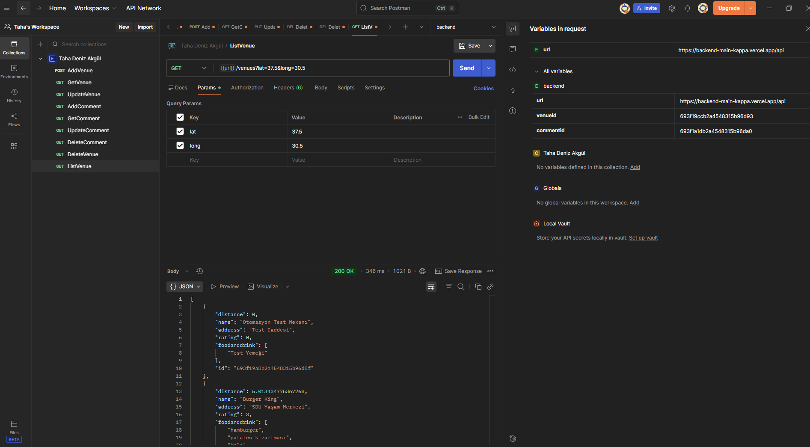
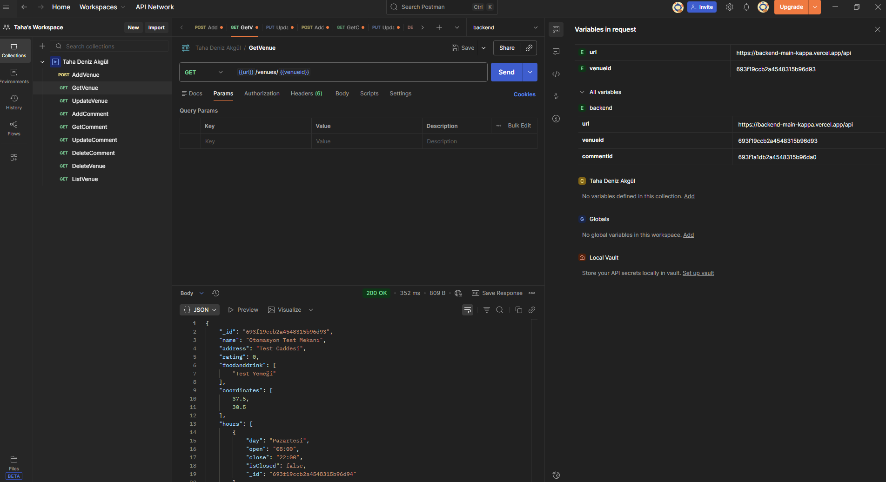
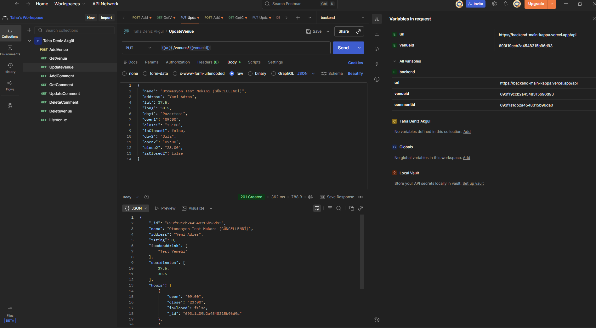
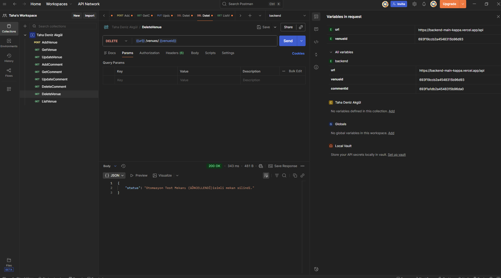
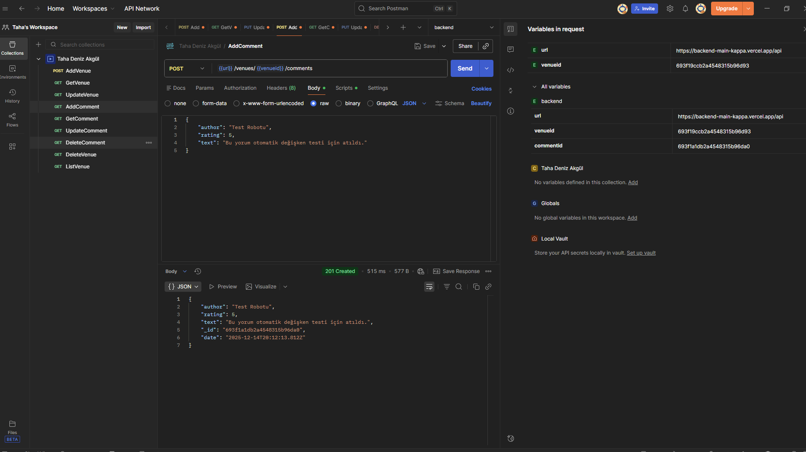
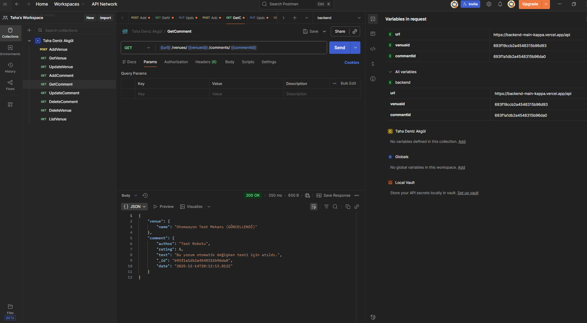
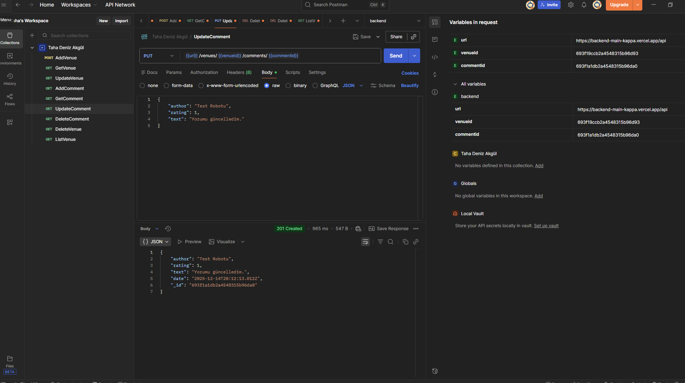

# Mekanbul API Projesi

Bu proje, SDU Full Stack Bootcamp kapsamında geliştirilen mekan bulma uygulaması backend servisidir. RESTful API mimarisi kullanılarak geliştirilmiş, MongoDB veritabanı ile entegre edilmiştir.

## 🔗 Canlı Bağlantı (Vercel)
Proje şu adreste canlı olarak çalışmaktadır (API Base URL):
> **[https://backend-main-kappa.vercel.app/api](https://backend-main-kappa.vercel.app/api)**

---

## 🚀 Kullanılan Teknolojiler
* **Runtime:** Node.js
* **Framework:** Express.js
* **Database:** MongoDB Cloud (Atlas)
* **Deployment:** Vercel
* **Test:** Postman

---

## 🧪 Postman Test Sonuçları

Aşağıda API uç noktalarının (endpoints) başarılı çalıştığını gösteren test sonuçları yer almaktadır.

### 1. Mekan İşlemleri (Venues)

**Tüm Mekanları Listeleme (GET)**

**Yeni Mekan Ekleme (POST)**

**Mekan Detayı Getirme (GET)**

**Mekan Güncelleme (PUT)**

**Mekan Silme (DELETE)**

---

### 2. Yorum İşlemleri (Comments)

**Mekana Yorum Ekleme (POST)**

**Yorum Getirme (GET)**

**Yorum Güncelleme (PUT)**

**Yorum Silme (DELETE)**

---

## 📂 Postman Koleksiyonu
API testlerini kendi bilgisayarınızda çalıştırmak için proje dosyasında bulunan `.json` uzantılı Postman koleksiyonunu import edebilirsiniz.